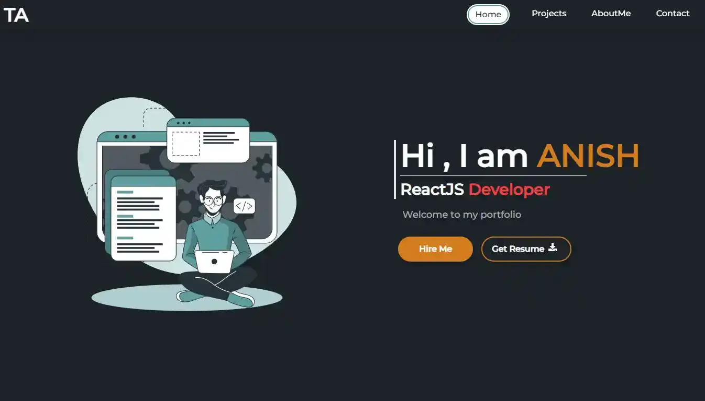

# my-folio

This is my personal portfolio website, where you may view my work and learn more about me.

<a href="https://tharuanish.netlify.app">View Demo</a>

## Installation

To clone and run this application, you'll need Git and Node.js (which comes with npm) installed on your computer. From your command line:

#Clone this repository \
$ git clone https://github.com/tharuAnish/my-folio.git

#Go into the repository \
$ cd my-folio

#Install dependencies \
$ npm install

#Run the app \
$ npm start

### Built With

We used many technologies to built the app . Mainly they are -

- 

- 
- 
- 

## Project Preview

